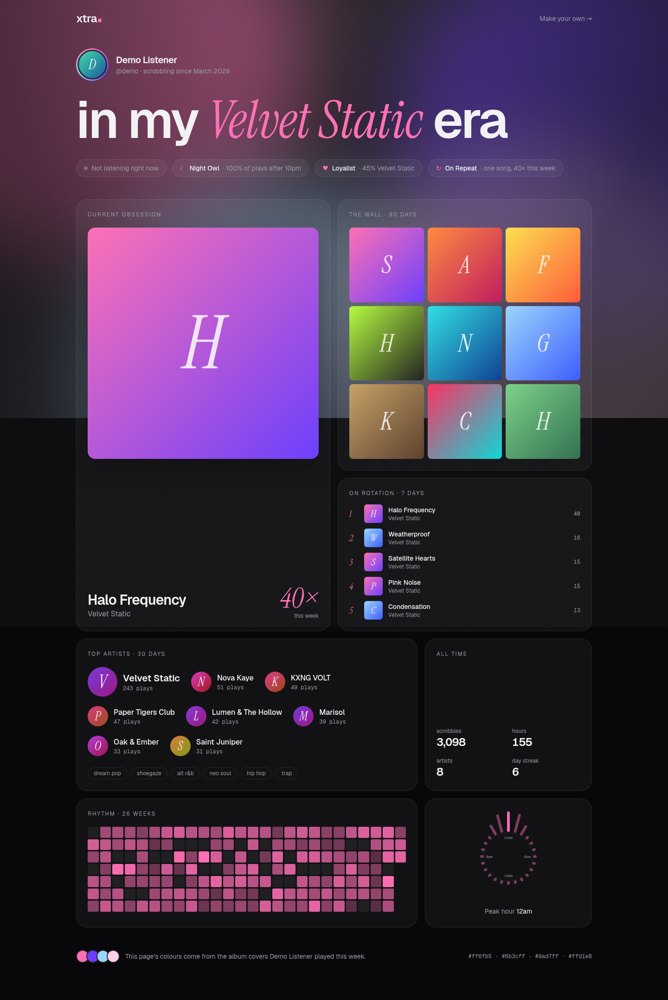

# xtra

A last.fm-style scrobbler for Spotify with a public profile page that **designs itself from what you listen to**. You can't pick a theme or a layout. Everything on the profile comes from your listening data:



| Profile element | Where it comes from |
| --- | --- |
| The sky (a generative WebGL background, unique per listener) | Your last 14 days, see below |
| Colour palette (sky, accent, light/dark mood) | Dominant colours pulled from the album covers you played most this week |
| Headline ("in my ___ era") | Your top artist over the last 14 days |
| Current obsession | Your most-played track this week (3+ plays) |
| Badges: Night Owl, Early Bird, Loyalist, Explorer, On Repeat, Album Head, Marathoner, Weekender | How and when you listened over the last 30 days |
| The wall | Your top 9 albums over the last 90 days |
| Rhythm heatmap, listening clock, streak | Your plays over the last 26 weeks, in your local time zone |
| Now playing | Live from your Spotify player |

### The sky

Every profile has a live, generative background: a nebula, aurora ribbons, a glowing core, sound-wave ripples and twinkling stars, all drawn in a single shader (`src/components/Aura.tsx`). How strong each layer is comes from your recent listening (`src/lib/aura.ts`):

| Layer | Driven by |
| --- | --- |
| Colours | Your most-played covers this week |
| Stars | Share of plays after dark |
| Nebula (amount and turbulence) | Artist variety, plus heavier genres |
| Core glow | Loyalty to your top artist |
| Ripples | A song on repeat |
| Aurora | Late nights and long tracks |
| Drift speed | Genre energy and plays per day |
| Layout | A seed from your current top artists, so it reshuffles when your rotation changes |

The profile page lists which of your stats set each layer ("Why the sky looks like this").

### What lives here: taste-driven page effects

On top of the sky, each profile runs a set of small interactive effects chosen from the listener's genres (`src/lib/vibes.ts`, rendered by `src/components/Atmosphere.tsx` with the effects in `src/effects/`). Genres come from Spotify, or from MusicBrainz tags when Spotify has none. Each artist is weighted by recent plays and Spotify's top-artist rankings, and each genre family unlocks its own effects:

| Taste | Effect | Interaction |
| --- | --- | --- |
| Melancholy / emo / shoegaze | Rain with a puddle | ripple it with the cursor |
| Metal | Little demons, lightning | click to banish (kills are counted); click the sky for a strike |
| Punk & hardcore | Mosh embers | swipe through them |
| Grunge & alt-rock | Film scratches & static | click for interference |
| Goth & post-punk | Bats | click to scatter |
| Dreamy | Bokeh, snow that banks up | pop the lights |
| Club | Lasers | click to drop the beat |
| Hip-hop | Spray paint | click to tag the wall |
| Jazz & blues | Smoke | wave through it |
| Classical & score | Floating notes | click to play one |
| Folk | Fireflies, falling leaves | they follow you; click for a gust |
| Country | Tumbleweed | click it |
| Pop | Cursor sparkles | move |
| K-pop / J-pop / anime | Petals | breeze |
| Latin & tropical | Confetti | click anywhere |
| Funk & disco | Mirror ball | — |
| R&B & soul | Lanterns | click to release one |
| Lo-fi & chill | VHS | click for tracking noise |
| Psychedelic | Lava lamp | — |
| Ambient & post-rock | Shooting stars | click to wish |
| Experimental | Glitches | click to corrupt |
| Indie | Paper planes | click to throw |
| *Habits:* early listening / wide variety / a song on repeat | Morning light / a constellation of your artists / a vinyl of the song | — / hover for names / drag to scratch |

Up to 8 effects run at once, scaled by how strong each taste is. Visitors can switch them off with the ✦ button, and they're disabled for anyone who prefers reduced motion.

### Profiles

Signing in with Spotify creates your account. You then claim a handle on `/welcome` and choose who can see your profile: **public** (listed on `/explore`), **unlisted** (link only, not indexed) or **private** (only you). You can change both, or delete everything, in `/settings`. The first person to sign in becomes the instance owner.

The private dashboard at `/me` has last.fm-style charts (top artists, albums and tracks for 7 days, 30 days, 90 days, 12 months or all time), recent scrobbles, manual sync and a history importer.

## Stack

Next.js 16 (App Router) · Tailwind CSS v4 · Drizzle ORM on libSQL (a local SQLite file in dev, [Turso](https://turso.tech) in production) · `sharp` for cover-art palettes.

## Running locally

1. Create an app at <https://developer.spotify.com/dashboard> and add the redirect URI `http://127.0.0.1:3000/api/auth/callback`. Spotify rejects `localhost`, so use `127.0.0.1`.
2. Copy the env file and fill it in:
   ```sh
   cp .env.example .env.local
   ```
3. Install, create the database, and optionally seed the demo profiles:
   ```sh
   npm install
   npm run db:migrate
   npm run db:seed   # optional: fictional listeners at /u/demo and /u/demo-rave
   npm run doctor    # checks env, Spotify credentials and the database
   npm run dev
   ```
4. Open <http://127.0.0.1:3000> and connect Spotify.

## How scrobbling works

- **Live:** Spotify's `recently-played` endpoint only returns your last 50 tracks. xtra syncs whenever you open the dashboard (if the last sync was more than 5 minutes ago), when someone views your profile, and whenever `GET /api/cron/sync` is called with `Authorization: Bearer $CRON_SECRET`. Call that endpoint every 30–60 minutes so you don't miss plays. The included GitHub Actions workflow (`.github/workflows/sync.yml`) does this once you set the `XTRA_URL` variable and the `CRON_SECRET` secret.
- **Rankings:** every 6 hours xtra also stores Spotify's top artists and tracks for ~4 weeks, ~6 months and ~1 year. These feed the headline, the wall, the vibes and a "past year" section, so a new profile has depth from its first sign-in.
- **Backfill:** drop the `my_spotify_data.zip` from Spotify's privacy page onto the dashboard. Both *Extended streaming history* (full lifetime, ids included) and *Account data* (last year, names only; tracks are matched via search) work. The zip is unpacked in the browser and only compact play rows are uploaded, in batches. As on last.fm, a play only counts after 30 seconds. Artwork, genres and matches fill in in the background after each sync.
- Artists and albums are keyed by name, so live and imported plays merge into the same charts.

## Deploying

See **[docs/SETUP.md](docs/SETUP.md)** for the full checklist (Spotify app, Vercel, Turso, scheduled sync, history import).

> Since February 2026, Spotify development-mode apps need the owner to have Premium, and allow at most 5 users. Each one must be added to the app's User Management list.

## Scripts

| Script | Purpose |
| --- | --- |
| `npm run dev` / `build` / `start` | Next.js |
| `npm run typecheck` / `lint` | Checks |
| `npm run db:generate` | Create a migration after editing `src/db/schema.ts` |
| `npm run db:migrate` | Apply migrations to the database |
| `npm run db:seed` | Seed the demo listeners |
| `npm run doctor` | Check env vars, Spotify credentials and the database |
